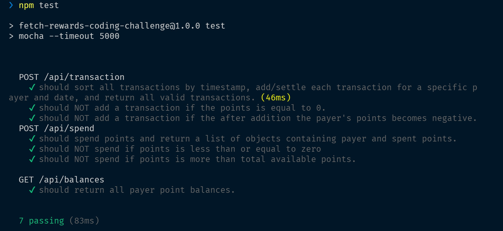

# Fetch Rewards - Coding Challenge

## Objective - To write a web service that accepts HTTP requests and returns responses based on the following conditions:
- A user can have `points` in their accounts from multiple `payers`.
- A transaction can be used to add/subtract `points` from a `payer`.
- When a user spends `points`, the oldest `points` should be spent first and no payer's points should go negative.

## My Approach
- I’m maintaining a `totalAvailablePoints` to keep track of the total available points for a user at any given time, a `payerBalanceMap` which is a hashmap containing the payer as a key and their available points as the corresponding value, and an array of `allValidTransactions`. These are updated accordingly whenever a new transaction or spend request is processed.
- When an HTTP POST request is sent to the `/api/transaction` route, I send an array of transactions, which can be in any order. I do sanity checks like ensuring the input is an array, the payer is not empty, the points are numeric, the timestamp is in the correct format etc. After that I sort the array, and process the transactions one-by-one. If the points are +ve, I add it to the `allValidTransactions` using binary search to maintain a sorted array. If -ve, and the payer has sufficient balance, I settle it with the transactions in `allValidTransactions` using oldest-first aproach. If the point is 0, or -ve when the payer doesn’t have sufficient balance, I add to the `invalidTransactions` array.
- When an HTTP POST request is sent to the `/api/spend` route, I send the points required to be spent. First, I do sanity checks and make sure the points are +ve, and the user has the `totalAvailablePoints` to settle this request. After that, I go over each transaction in the `allValidTransactions` and try to settle the spend points. Once settled, I stop looking at other transactions, and filter out those that were expended to spend the points. I keep track of the spend details, i.e., which payer spent how much and return that in the end.
- When an HTTP GET request is sent to the `/api/balance` route, I return the user’s `payerBalanceMap`.

NOTE : My asssumption for processing transaction is that if the array contains min date as 5th Oct and max Date as 15th Oct, then the future transaction array will not contain dates before 15th Oct. If that is not true, I would use a different approach. When I receive a transaction array, I would just filter out +ve and -ve point transactions in two different arrays and sort them, update `payerBalanceMap` and `totalAvailablePoints`, and not settle them with each other until I receive a spend request for the user. Once I receive a spend request, I would settle the -ve point transactions with the +ve ones, and then start the spending process.

## Steps to Run
- Ensure node is installed in your local machine and clone the git repo using : ```https://github.com/vandanachandola/fetch-rewards-coding-challenge.git```.
- Go to the root directory of the local repo and install npm dependencies using : ```npm install```.
- Run the project using the command : ```npm start``` or ```node index.js```. The terminal should display "listening on port 3000" message.
- While running, run the command ```npm test``` in a new terminal to run tests.
- Navigate to the URL ```http://localhost:3000``` in the browser and use the routes provided below to use the web service.

## Routes Provided
1. `/api/transaction` - HTTP POST request to add transactions for a specific payer and date.
  #### Example : ```http://localhost:3000/api/transcation```
  
  
2. `/api/spend` - HTTP POST request to spend points using the rules above and return a list of ```{"payer": <string>, "points": <integer>}``` for each call.
  #### Example : ```http://localhost:3000/api/spend```
  
  
3. `/api/balances` - HTTP GET request to return all payer point balances.
  #### Example : ```http://localhost:3000/api/balances```  
  
  
## Running Tests
Run tests using the command `npm test`.
  
