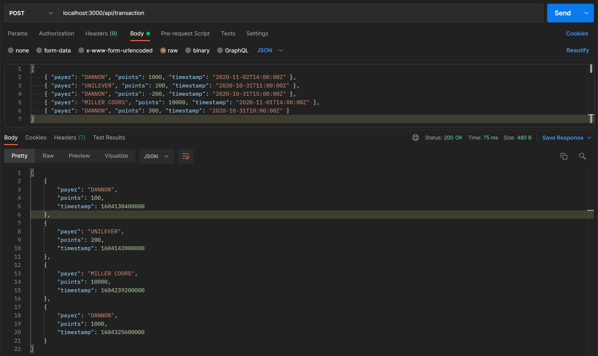
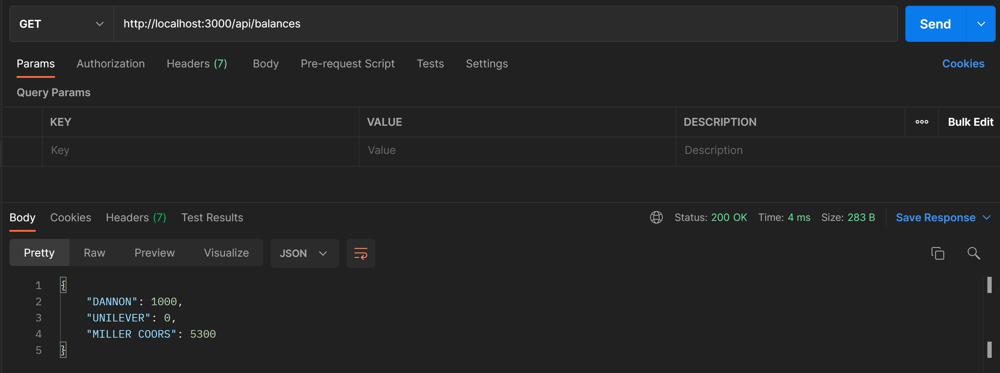

# Fetch Rewards - Coding Challenge

## Objective - To write a web service that accepts HTTP requests and returns responses based on the following conditions:
- A user can have `points` in their accounts from multiple `payers`.
- A transaction can be used to add/subtract `points` from a `payer`.
- When a user spends `points`, the oldest `points` should be spent first and no payer's points should go negative.

## Steps to Run
- Ensure node is installed in your local machine and clone the git repo using : ```https://github.com/vandanachandola/fetch-rewards-coding-challenge.git```.
- Go to the root directory of the local repo and install npm dependencies using : ```npm install```.
- Run the project using the command : ```npm start``` or ```node index.js```. The terminal should display "listening on port 3000" message.
- Navigate to the URL ```http://localhost:3000``` and use the routes provided below to use the web service.

## Routes Provided
1. `/api/transaction` - HTTP POST request to add transactions for a specific payer and date.
  #### Example : ```http://localhost:3000/api/transcation```
  
  
2. `/api/spend` - HTTP POST request to spend points using the rules above and return a list of ```{"payer": <string>, "points": <integer>}``` for each call.
  #### Example : ```http://localhost:3000/api/spend```
  
  
3. `/api/balances` - HTTP GET request to return all payer point balances.
  #### Example : ```http://localhost:3000/api/balances```  
  
